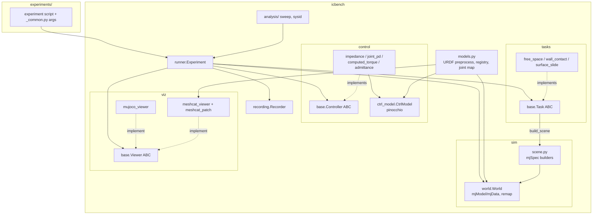
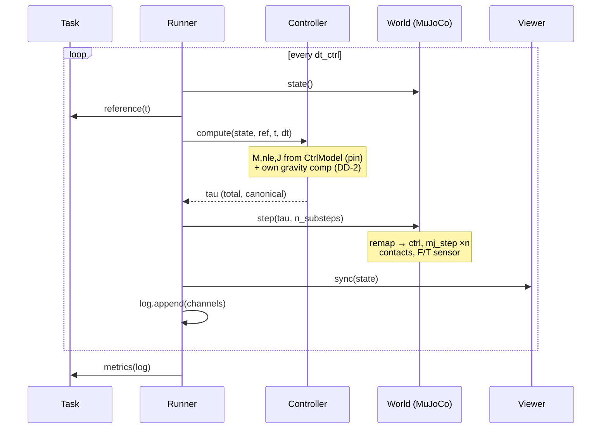

# System Design Document — Experimental Simulation Package (`icbench`)

Rev 1 — 2026-07-17. Satisfies [requirements.md](requirements.md); verified per
[verification.md](verification.md); built per [plan.md](plan.md).

## 1. Architecture Overview

Two-engine split: **MuJoCo is the world** (truth: contacts, friction, actuator
limits, sensors), **Pinocchio is the controller's model** (what the control law
*believes*: M, nle, g, Jacobians). Both are built from one preprocessed URDF so
the belief matches the truth exactly at first — later robustness studies
(REQ-ANA-001) deliberately perturb the *controller side only*.



### 1.1 Key design decisions

| ID | Decision | Rationale | Satisfies |
|---|---|---|---|
| DD-1 | Dual engine, single URDF, preprocessing in `models.py` | No model mismatch; MuJoCo can't read `package://` or DAE | REQ-MDL-002 |
| DD-2 | **Gravity convention**: plant real, controllers output total torque (own g/nle comp via CtrlModel) | Legacy plant `aba(q,dq,tau+g)` hides compensation; copying it would make every MuJoCo result wrong | REQ-SIM-006, REQ-CTL-001 |
| DD-3 | Canonical joint order = URDF/pinocchio order; World owns the mj↔canonical remap as *data* (index map from models.py) | One convention at every component boundary; ordering bugs become impossible to write silently | REQ-MDL-003, REQ-SIM-002 |
| DD-4 | Typed `Reference` covering pose/twist/accel, joint targets, wrench target — from day one | Contact tasks (wrench) and joint controllers (q_des) otherwise force interface rework in Phases 4/6 | REQ-TSK-001, REQ-CTL-006 |
| DD-5 | LogSchema (fixed channel names/units) defined in runner at Phase 2; Task.metrics and Recorder consume it | Single contract; no silent field drift | REQ-EXP-001, REQ-REC-001 |
| DD-6 | Config dataclasses per controller/task, dict-constructible | YAML sweep layer maps dicts→dataclasses with zero controller changes | REQ-CTL-007, REQ-ANA-001 |
| DD-7 | MuJoCo viewer authoritative; meshcat best-effort mirror | Physics scene truth vs pretty visuals; bounded maintenance | REQ-VIZ-001/002 |
| DD-8 | Tasks own all scene geometry (incl. floor) | Free-fall tests and free-space parity need an empty world | REQ-TSK-001 |
| DD-9 | Effort limits on actuators by default, opt-out flag | Realistic torque saturation for honest comparisons | REQ-MDL-005 |

## 2. Data Design

### 2.1 Core types (canonical order everywhere)

```python
@dataclass
class State:
    q: np.ndarray          # (nv,) rad — canonical order
    dq: np.ndarray         # (nv,) rad/s
    tau_applied: np.ndarray# (nv,) N·m — last commanded torque
    t: float               # s

@dataclass
class Reference:
    pose: pin.SE3 | None          # task-space target
    twist: np.ndarray | None      # (6,) LOCAL_WORLD_ALIGNED
    accel: np.ndarray | None      # (6,)
    q_des: np.ndarray | None      # joint-space targets (joint controllers)
    dq_des: np.ndarray | None
    ddq_des: np.ndarray | None
    wrench_des: np.ndarray | None # (6,) world-aligned, robot-on-env positive
```

### 2.2 LogSchema channels (fixed at Phase 2; append-only afterwards)

| Channel | Shape/step | Unit | Source |
|---|---|---|---|
| `t` | () | s | runner |
| `q`, `dq`, `tau` | (nv,) | rad, rad/s, N·m | World / controller |
| `ee_pos`, `ee_rpy` | (3,) | m, rad | CtrlModel FK |
| `ee_vel` | (6,) | m/s, rad/s | J·dq |
| `ee_wrench_ft` | (6,) | N, N·m | World F/T sensor (world-aligned) |
| `ee_wrench_contact` | (6,) | N, N·m | Σ mj_contactForce (ground truth) |
| `ref_*` | mirrors Reference fields | — | Task |

New channels may be appended; existing names/units never change (DD-5).

### 2.3 Run artifact (Recorder, REQ-REC-001)

```
data/runs/<UTC-timestamp>_<experiment>/
  config.json      # full config dataclasses + seed + git SHA
  timeseries.npz   # LogSchema arrays
  metrics.json     # Task.metrics output
  *.png            # the same plots the interactive run shows
```

## 3. Component Design

### 3.1 `models.py`

- `load_robot(name: str) -> RobotBundle`
- Steps: locate URDF+meshes via example-robot-data → preprocess to a temp URDF
  (rewrite `package://example-robot-data/` → absolute share path; strip `<visual>`
  if MuJoCo's `discardvisual` proves insufficient in the Phase 0 spike) → build
  pin `RobotWrapper` (with DAE visual model for meshcat) → build `mjSpec` robot
  (compiler: `balanceinertia=false`) → derive joint index map by *name* matching.
- `RobotBundle`: pin wrapper, preprocessed URDF path, mesh dir, joint map,
  `q_pin_from_mj / v_pin_from_mj / v_mj_from_pin` converters, effort limits.
- Guards (REQ-MDL-004): raise on unmatched joint names, `pin.nq != pin.nv`
  (continuous joints — unsupported until converters extended), nonzero URDF
  `<dynamics>` damping/friction.
- Errors: fail at load time with the offending joint/mesh named.

### 3.2 `sim/scene.py`

- `attach_actuators(spec, bundle, use_effort_limits=True)` — one `<motor>` per
  joint, `forcerange=±effort` (DD-9).
- `add_ee_sensor(spec, site_name="ee")` — site at ee frame + force/torque sensor.
- `add_floor(spec)`, `add_wall(spec, pose, size, friction)` — called only from
  `Task.build_scene` (DD-8).

### 3.3 `sim/world.py`

- Owns `mjModel/mjData`, the remap, and stepping:
  `step(tau_canonical, n_substeps)` → map to mj order → set `ctrl` → `mj_step`×n.
- `state() -> State` (canonical), `ee_wrench()` (sensor → rotate by site `xmat`
  into world axes → sign per Conventions), `contacts()` (raw, X-normal frame
  documented at the accessor), `apply_external_wrench(frame, wrench)`
  (`xfrc_applied`, cleared each step unless re-applied — REQ-SIM-005).
- No gravity logic anywhere (DD-2): World never adds/removes compensation.

### 3.4 `control/ctrl_model.py`

- Pinocchio wrapper: `M(q)`, `nle(q,dq)`, `g(q)`, `coriolis(q,dq)`
  (`computeCoriolisMatrix`), `frame_jacobian(q, frame)` / `frame_jacobian_dot`
  (LOCAL_WORLD_ALIGNED), `fk(q, frame) -> SE3`.
- Stateless per call; canonical order in/out. Later: constructor takes optional
  parameter perturbations (payload error etc.) for robustness studies.

### 3.5 `control/impedance.py` (and zoo)

- `TaskSpaceImpedance(ctrl_model, config)` with `variant ∈ {2,3,4}`; reformulated
  per DD-2: e.g. variant 4 becomes `tau = Jᵀ(Kd·x_err + Dd·v_err) + g(q)`
  (legacy relied on the plant's hidden `+g`). Variants 2/3 replace the legacy
  broadcast-bug term with `(C(q,dq) − M·J⁺·dJ)·J⁺·v_des` using the Coriolis
  *matrix*; all task-space inverses via damped least squares
  (`J⁺ = Jᵀ(JJᵀ+λ²I)⁻¹`) with manipulability-based λ scheduling (REQ-CTL-005).
- Derivations recorded in findings.md (REQ-CTL-003 Ver=A part).
- `control_rate_hz` declared per instance (variant 2 → 1000).
- Zoo (Phase 6): `JointPD`, `ComputedTorque`; `Admittance(inner: Controller, ...)`
  — outer wrench→motion loop, 1st-order low-pass on `ee_wrench_ft` (cutoff
  config, default well below inner-loop bandwidth), composes inner tracking
  controller at 1 kHz (REQ-CTL-006).

### 3.6 `tasks/`

- `Task.build_scene(spec)`: all env geometry. `reference(t) -> Reference`.
  `metrics(log) -> dict`.
- `FreeSpace`: regulation / sinusoidal modes + optional sine ee-force disturbance
  (via World primitive) — parity with legacy `fe_amp·sin(fe_angf·t)` behavior.
- `WallContact`: phase machine (approach → press); `wrench_des` ramps to target;
  metrics from `ee_wrench_contact`: steady-state error, overshoot, settling time.
- `SurfaceSlide`: path + constant normal force; force RMSE metric.

### 3.7 `viz/`

- `MujocoViewer`: `mujoco.viewer.launch_passive`; syncs at wall-clock rate,
  drops frames rather than slowing physics.
- `MeshcatViewer`: pin `MeshcatVisualizer` (DAE visuals) driven by canonical q;
  scene props mirrored from task metadata (wall → box) best-effort (DD-7).
  Imports `meshcat_patch.py` — the merge_geometries bundle patch, single source,
  loud warning when bundle matches neither pattern (REQ-VIZ-004); the legacy
  script imports the same module.

### 3.8 `runner.py`

```
Experiment(bundle, task, controller, viewer, dt_ctrl=None).run(duration)
  dt_ctrl = controller.control_rate default; n_substeps = dt_ctrl/dt_phys (int, validated)
  loop: state ← World.state(); ref ← task.reference(t)
        tau ← controller.compute(state, ref, t, dt_ctrl)
        World.step(tau, n_substeps); viewer.sync(state); log.append(...)
  return log (LogSchema), task.metrics(log)
```

Owns LogSchema assembly (DD-5) and the seed (`np.random.default_rng(seed)` passed
to any stochastic component; REQ-SIM-007).

### 3.9 `recording.py`, `analysis/`

- `Recorder.save(run_dir_name, config, log, metrics, figs)` per §2.3.
- `analysis/sweep.py`: YAML → list of config dicts → dataclasses (DD-6) →
  `multiprocessing` pool of headless runs → `metrics.parquet` + markdown report.
- `analysis/sysid/payload_estimation.py`: regressor least-squares / RLS on
  (q, dq, ddq_est, tau) with known-model terms from CtrlModel; ground truth from
  the sweep payload machinery; reports estimate error + convergence time.

## 4. Interface Control (cross-cutting contracts)

| Contract | Definition | Enforced by |
|---|---|---|
| Joint order | canonical = URDF/pinocchio; map is data | TC-MDL-002 |
| Frames | ee task quantities LOCAL_WORLD_ALIGNED; wrenches world-aligned | TC-SIM-003 |
| Wrench sign | robot-on-environment positive | TC-SIM-003 |
| Contact frame | mj X-axis = normal; documented at accessor | code review (I) |
| Gravity | plant real; controllers self-compensate | TC-CTL-001, TC-SYS-001 |
| LogSchema | names/units fixed, append-only | TC-EXP-001 |
| Orientation error | `rpy(R_des·Rᵀ)` (documented limitation) | findings.md note |

## 5. Dynamic View — control loop with contact



## 6. Risks & Open Items

| ID | Risk / open item | Mitigation / resolution point |
|---|---|---|
| R-1 | mjSpec URDF parsing quirks in mujoco 3.10 (compiler options exposure, visual handling) | Phase 0 spike; fallback: one-time MJCF export + committed template |
| R-2 | UR5 URDF inertias violate triangle inequality → compile failure with `balanceinertia=false` | Spike; if so, minimally repair inertias in preprocessing and document (A-1) |
| R-3 | Stiff wall contact + 1 kHz ZOH torque chatter | Tune solref/solimp per task; document in findings.md |
| R-4 | Meshcat mirror drifting from MuJoCo scene | Accepted (DD-7); MuJoCo viewer is authority |
| R-5 | EGL headless unavailable on some setup | Phase 0 spike verifies; sweeps need no rendering unless videos requested |
| R-6 | Legacy parity harness dt/integrator sensitivity | Parity test replicates legacy integrator exactly (Euler, legacy dt), not MuJoCo |
