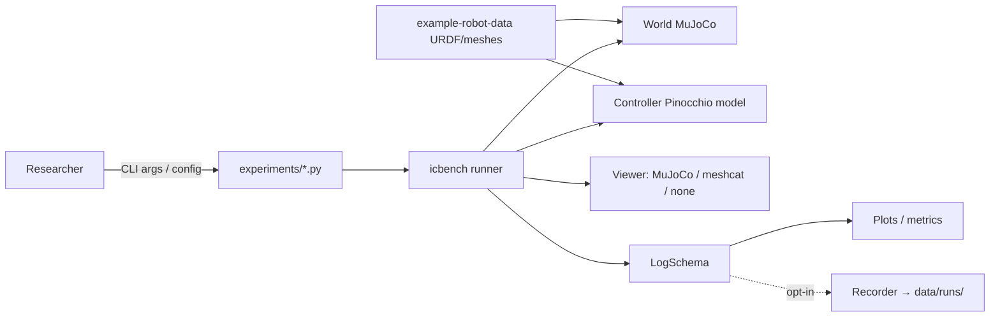

# System Requirements Specification — Experimental Simulation Package (`icbench`)

Rev 1 — 2026-07-17. Part of the document set:

| Doc | Answers |
|---|---|
| **requirements.md** (this) | What must the system do, and why |
| [design.md](design.md) | How it is built |
| [verification.md](verification.md) | How we prove it (test cases + traceability) |
| [plan.md](plan.md) | In what order (phased implementation schedule) |

## 1. Purpose & Scope

An experimental simulation package for robot-arm control analysis: contact-capable
physics (MuJoCo) with model-based control (Pinocchio), controller comparison,
robustness sweeps, and estimation testbeds. Single primary user (research
engineer). Out of scope: ROS integration, real-robot interfaces, GPU/parallel
simulation, RL training.

**Verification methods** — T: automated test, D: demonstration (manual, scripted
steps), A: analysis (derivation/measurement documented in findings.md),
I: inspection (code/docs review).
**Priority** — M: must, S: should, C: could (MoSCoW).

## 2. Stakeholder Needs

| ID | Need |
|---|---|
| SN-1 | Evaluate interaction controllers (impedance & friends) against realistic contact physics, not synthetic force injections |
| SN-2 | Compare multiple controllers on identical tasks with quantitative metrics |
| SN-3 | Assess robustness to parameter uncertainty and disturbances via batch sweeps |
| SN-4 | Ground-truth testbed for estimation / system-ID algorithms (payload estimation first) |
| SN-5 | Interactive visual inspection during runs; plots for analysis afterwards |
| SN-6 | Results reproducible; codebase maintainable by one engineer |
| SN-7 | Legacy demo scripts keep working (upstream fork heritage) |

## 3. System Context

System boundary: everything under `icbench/` + `experiments/`. External: MuJoCo,
Pinocchio, example-robot-data, meshcat, matplotlib.

## 4. Functional Requirements

### 4.1 Modeling (MDL)

| ID | Requirement | Rationale | Pri | Ver | Trace |
|---|---|---|---|---|---|
| REQ-MDL-001 | The system shall load a robot by name from example-robot-data, with UR5 as the reference model. | Pluggable robots | M | T | SN-1..4 |
| REQ-MDL-002 | The system shall load the *same* URDF into both engines, preprocessing it for MuJoCo (resolve `package://` URIs; ensure DAE visuals are discarded/stripped; inertia balancing disabled). | No sim-vs-controller model mismatch | M | T | SN-1, SN-6 |
| REQ-MDL-003 | The system shall construct an explicit MuJoCo↔canonical joint index map and state converters, never assuming identity ordering. | pin.nq ≠ mj.nq possible; ordering is a classic silent bug | M | T | SN-6 |
| REQ-MDL-004 | The system shall reject (with a clear error) robots violating supported assumptions: pin/mj state dimension mismatch without a converter, or nonzero URDF `<dynamics>` not replicated on the pinocchio side. | Fail loudly, not wrongly | M | T | SN-6 |
| REQ-MDL-005 | The system shall attach one torque actuator per joint with `forcerange` from URDF effort limits, with a documented opt-out for idealized studies. | Unbounded torque flatters controllers, invalidates sweeps | M | T | SN-2, SN-3 |

### 4.2 Simulation (SIM)

| ID | Requirement | Rationale | Pri | Ver | Trace |
|---|---|---|---|---|---|
| REQ-SIM-001 | The World shall step MuJoCo physics at dt_phys (1–2 ms) with the control period an integer multiple (per-controller/task property). | Stability of stiff controllers/contact | M | T | SN-1 |
| REQ-SIM-002 | The World shall expose canonical-order `State (q, dq, tau_applied, t)`. | Single convention at component boundaries | M | T | SN-6 |
| REQ-SIM-003 | The World shall report the ee wrench rotated into world-aligned axes with the documented sign convention (robot-on-environment positive). | MuJoCo F/T sensors report in body-fixed site frame | M | T | SN-1 |
| REQ-SIM-004 | The World shall enumerate contacts with forces (ground truth), documenting MuJoCo's X-axis-is-normal contact frame at every use site. | Contact metrics need truth data | M | T | SN-1 |
| REQ-SIM-005 | The World shall support external wrench injection at a named frame, usable from Phase 2 (free-space disturbance parity) and schedulable later. | Legacy sine disturbance; robustness studies | M | T | SN-1, SN-3 |
| REQ-SIM-006 | The plant shall be real: gravity applied by MuJoCo, no hidden compensation anywhere in World. | Legacy plant secretly cancels g; must not be replicated | M | T/I | SN-1 |
| REQ-SIM-007 | A simulation run shall be deterministic given (config, seed). | Reproducibility, regression testing | M | T | SN-6 |

### 4.3 Control (CTL)

| ID | Requirement | Rationale | Pri | Ver | Trace |
|---|---|---|---|---|---|
| REQ-CTL-001 | Controllers shall implement `compute(state, ref, t, dt) -> tau` returning **total** torque including their own gravity/nle compensation. | Gravity convention (see design DD-2) | M | T | SN-1, SN-2 |
| REQ-CTL-002 | A control-side model (`ctrl_model`) shall provide M, nle, g, Coriolis matrix, frame J/dJ, FK — canonical order, LOCAL_WORLD_ALIGNED frames. | Model-based control terms | M | T | SN-1 |
| REQ-CTL-003 | Task-space impedance variants (legacy 2/3/4) shall be provided as *reformulated* controllers: explicit gravity/nle comp; correct Coriolis-matrix term replacing the legacy vector−matrix broadcast bug; derivations documented. | Legacy code has verified math bugs | M | T/A | SN-1, SN-7 |
| REQ-CTL-004 | Each controller shall declare its control rate (legacy variant 2: 1 kHz; contact tasks: 1 kHz default). | Variant 2 designed at wn=250 rad/s | M | T | SN-1 |
| REQ-CTL-005 | Task-space inverses shall be singularity-robust (damped least squares + manipulability guard). | Legacy `inv(J)` unguarded | M | T | SN-1 |
| REQ-CTL-006 | The controller zoo shall include joint PD, computed torque, and admittance; admittance as an outer loop over an inner tracking controller with low-pass-filtered measured wrench. | Comparison studies; admittance needs inner loop | S | T | SN-2 |
| REQ-CTL-007 | Every controller/task shall take a `@dataclass` config constructible from a plain dict. | Sweep layer must not force refactors | M | T | SN-3, SN-6 |

### 4.4 Tasks (TSK)

| ID | Requirement | Rationale | Pri | Ver | Trace |
|---|---|---|---|---|---|
| REQ-TSK-001 | Tasks shall own all environment geometry (incl. floor), reference generation (typed `Reference`: pose/twist/accel, joint targets, wrench target), and metrics from the LogSchema. | Clean separation; no phantom floor contacts | M | T/I | SN-1, SN-2 |
| REQ-TSK-002 | A free-space task shall provide regulation + sinusoidal tracking + sine ee-force disturbance (legacy parity). | Baseline & port validation | M | T | SN-7 |
| REQ-TSK-003 | A wall-contact task shall press to a target normal force; metrics: steady-state force error, overshoot, settling time (from contact ground truth). | First contact analysis | M | T | SN-1 |
| REQ-TSK-004 | A surface-slide task shall track constant normal force along a path; metric: force RMSE. | Second contact analysis | S | T | SN-1 |

### 4.5 Visualization (VIZ)

| ID | Requirement | Rationale | Pri | Ver | Trace |
|---|---|---|---|---|---|
| REQ-VIZ-001 | The MuJoCo native viewer shall be available as the authoritative view (true physics scene), near-real-time in interactive mode. | Trustworthy inspection | M | D | SN-5 |
| REQ-VIZ-002 | A meshcat viewer shall be available as an optional robot mirror (DAE visuals; scene props best-effort). | User preference; remote/browser viewing | S | D | SN-5 |
| REQ-VIZ-003 | Runs shall be executable headless (`--viewer none`). | Batch sweeps | M | T | SN-3 |
| REQ-VIZ-004 | The meshcat viewer-bundle patch shall live in one module, warn loudly when the bundle matches neither known pattern, and be reused by the legacy script. | Silent no-op caused a long debugging session | M | T/I | SN-6, SN-7 |

### 4.6 Experiments & Recording (EXP / REC)

| ID | Requirement | Rationale | Pri | Ver | Trace |
|---|---|---|---|---|---|
| REQ-EXP-001 | A runner shall compose robot+task+controller+viewer, run for a duration, and assemble the fixed-schema log (channel names/units defined once). | Shared contract runner↔metrics↔recorder | M | T | SN-2, SN-6 |
| REQ-EXP-002 | Experiment scripts shall be thin, sharing argparse conventions (`--seed --viewer --record --duration`) via a common helper. | Prevent copy-paste drift | M | I | SN-6 |
| REQ-EXP-003 | Interactive runs shall end with matplotlib plots of task-relevant channels. | Interactive-first consumption | M | D | SN-5 |
| REQ-REC-001 | An opt-in Recorder shall write a timestamped run dir: config snapshot, timeseries, metrics, plots. | Batch analysis, reproducibility | M | T | SN-3, SN-6 |
| REQ-REC-002 | Run outputs shall be excluded from version control (`data/runs/` gitignored). | Repo policy bans data files | M | I | SN-7 |

### 4.7 Analysis (ANA)

| ID | Requirement | Rationale | Pri | Ver | Trace |
|---|---|---|---|---|---|
| REQ-ANA-001 | A sweep driver shall run YAML-defined parameter grids (payload, friction, gains) headless, in parallel, aggregating metrics into a single artifact + report. | Robustness studies | S | T | SN-3 |
| REQ-ANA-002 | Disturbance schedules (time profiles over the REQ-SIM-005 primitive) shall be sweepable parameters. | Disturbance rejection studies | S | T | SN-3 |
| REQ-ANA-003 | A payload-estimation testbed shall estimate ee payload mass/inertia from joint torques + motion, reporting error vs sim ground truth. | SysID need | S | T | SN-4 |

## 5. Non-Functional Requirements

| ID | Requirement | Pri | Ver | Trace |
|---|---|---|---|---|
| REQ-NFR-001 | Cross-engine model consistency: pin {g(q), nle(q,dq), M(q)} vs MuJoCo equivalents agree within relative tolerance 1e-6 over seeded random states. | M | T | SN-1, SN-6 |
| REQ-NFR-002 | A 10 s free-space simulation (headless, no recording) completes in ≤ 10 s wall-clock on the dev machine (≥ 1× real-time). Measured and recorded in findings.md. | S | A | SN-3 |
| REQ-NFR-003 | Same (config, seed) ⇒ identical LogSchema arrays across two runs (bitwise; documented relaxation to tolerance if a nondeterminism source is found and justified). | M | T | SN-6 |
| REQ-NFR-004 | Runs on Ubuntu 20.04 / Python 3.12 venv with pip-only pinned dependencies (`requirements.txt`). | M | I | SN-6 |
| REQ-NFR-005 | Every phase lands with green pytest; core physics/controller math covered by unit + integration tests; conventions documented in plan.md §Conventions. | M | T/I | SN-6 |
| REQ-NFR-006 | Legacy scripts (`controllers/*.py`) remain functional and behaviorally unchanged. | M | T/D | SN-7 |
| REQ-NFR-007 | Adding a new experiment requires only a new script + config (no core changes); adding a controller requires only a new Controller subclass + config dataclass. | S | I/D | SN-2, SN-6 |

## 6. Assumptions & Constraints

- A-1: example-robot-data UR5 URDF inertias are taken as-is (known to be rough);
  cross-engine consistency is about *both engines agreeing*, not matching the real
  robot.
- A-2: MuJoCo's soft-contact model (default solref/solimp) is acceptable contact
  truth for controller comparison; absolute contact fidelity vs reality is out of
  scope.
- A-3: Single developer; no CI server — pytest-before-commit is the gate
  (REQ-NFR-005).
- C-1: No internet access assumed at runtime (models vendored via pip packages).
